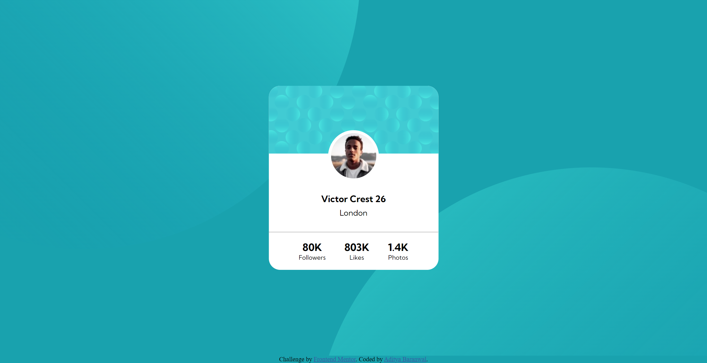

# Frontend Mentor - Profile card component solution

This is a solution to the [Profile card component challenge on Frontend Mentor](https://www.frontendmentor.io/challenges/profile-card-component-cfArpWshJ). Frontend Mentor challenges help you improve your coding skills by building realistic projects. 

## Table of contents

- [Overview](#overview)
  - [The challenge](#the-challenge)
  - [Screenshot](#screenshot)
  - [Links](#links)
- [My process](#my-process)
  - [Built with](#built-with)
  - [What I learned](#what-i-learned)
  - [Continued development](#continued-development)
  - [Useful resources](#useful-resources)
- [Author](#author)
- [Acknowledgments](#acknowledgments)

## Overview

### The challenge

- Build out the project to the designs provided

### Screenshot

.png)

### Links

- Solution URL: [https://github.com/CHARLIEADITYA/profile-card-component-main.git]
- Live Site URL: [https://charlieaditya.github.io/profile-card-component-main/]

## My process

### Built with

- Semantic HTML5 markup
- CSS custom properties
- Flexbox
- Mobile-first workflow
- [Styled Components](https://styled-components.com/) - For styles

## Author

- Website - [github](https://github.com/CHARLIEADITYA)
- Frontend Mentor - [@CHARLIEADITYA](https://www.frontendmentor.io/profile/CHARLIEADITYA)
- LINKDIN - [Aditya Baranwal](https://www.linkedin.com/in/aditya-baranwal-805978224/)

